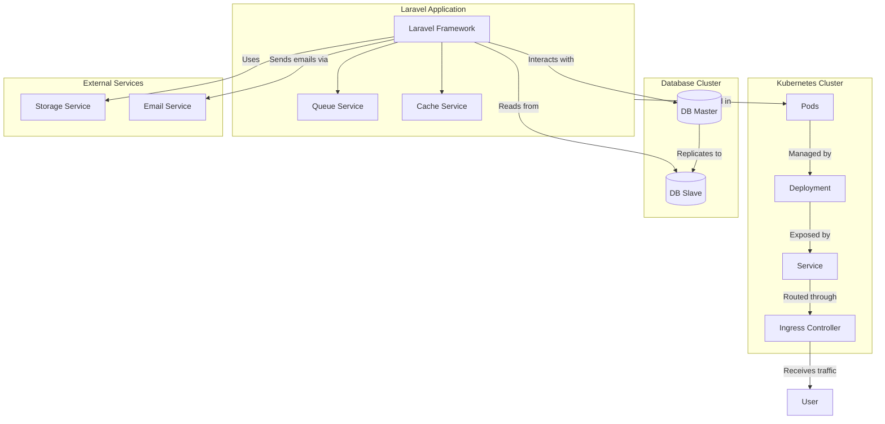

# TODO

## Guest can
- see home page (page) ✅
- see ranking result in home page (page) ✅

## Members can
- log in (page) ✅
- see list of quizzes (page) ✅
- see quiz details (page) ✅
- take a quiz (page) ✅
- see quiz result (page) ✅

